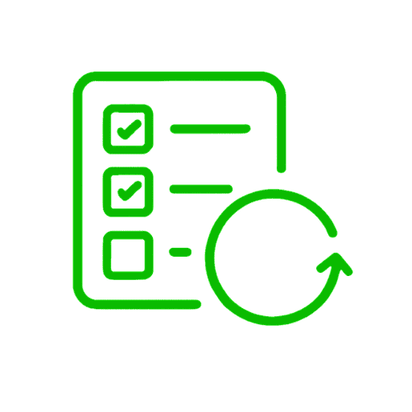

# Fetch TODOs (Logseq Plugin)

Fetch TODO items from a referenced page and insert links to selected tasks into your current location.

## What it does

- Detects a page reference like `[[My Project]]` from the current block (or its parent block).
- Scans that page for blocks that start with `TODO`.
- Shows a selector UI so you can choose one or more TODOs.
- Inserts block references (`((uuid))`) for selected TODOs into the current position.

## How to use

1. In a block (or its parent), include a page reference like `[[My Project]]`.
2. Run one of these commands:
   - Command palette: `Fetch TODOs from page`
   - Slash command: `Fetch TODOs`
3. Select TODOs from the popup.
4. Click `Add TODOs`.

## Development

This plugin is currently a plain JavaScript Logseq plugin with:

- `index.html` as the plugin entry.
- `index.js` for plugin logic.

## Release

This repository includes a GitHub Actions workflow at `.github/workflows/publish.yml`.

To publish:

1. Create and push a tag like `v0.1.0`.
2. Create a GitHub Release from that tag.
3. Wait for the workflow to attach a plugin zip asset to the release.
